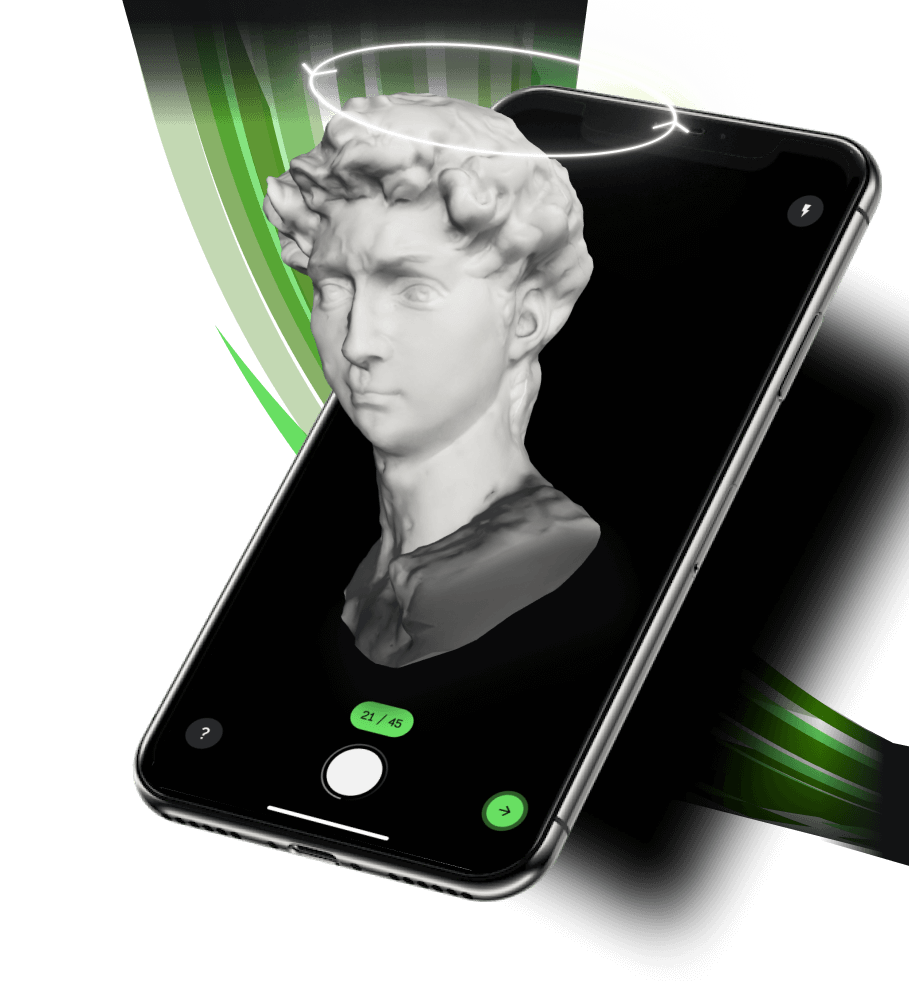
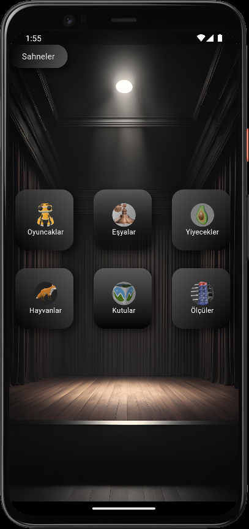
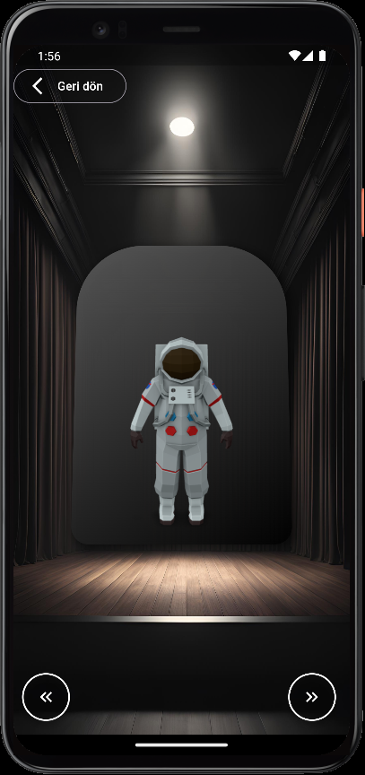
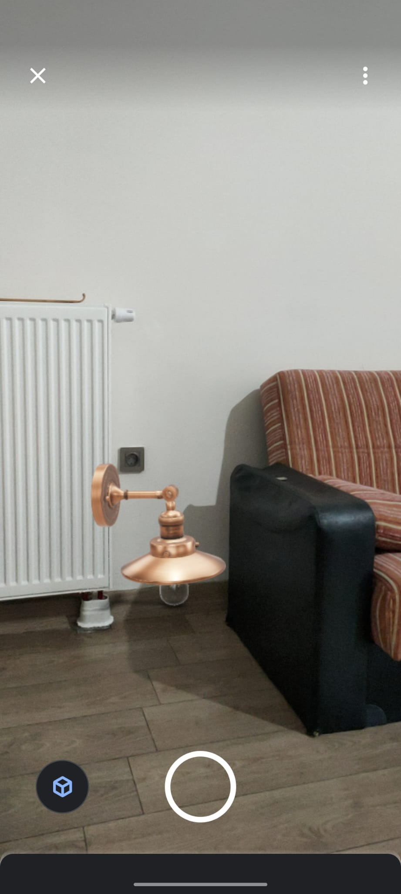
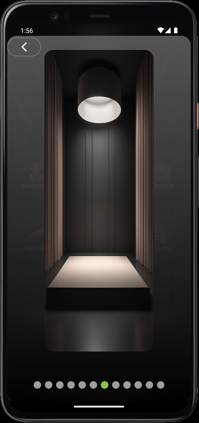

# -ModelAR- 3D Model İnceleme ve AR Yerleştirme Uygulaması 

Bu Flutter uygulaması, kullanıcılara farklı kategorilerde 3D modelleri keşfetme ve artırılmış gerçeklik (AR) modu ile kamerada etraflarında modelleri yerleştirme imkanı sunar. Kullanıcılar ayrıca model fotoğrafları çekebilir ve farklı sahne arka planları ile görsel deneyimi geliştirebilirler.



## Özellikler

- **3D Model İncelemesi**: Oyuncaklar, eşyalar, yiyecekler, hayvanlar, kutular ve ölçüler gibi farklı kategorilerde 3D modelleri keşfedin.
  
- **AR Modu**: Seçtiğiniz 3D modeli gerçek dünyada kameranız ile yerleştirin. Modelin konumunu, boyutunu ayarlayın ve fotoğraf çekin.

- **Arka Plan Sahne Değiştirme**: Kullanıcılar, model kategorilerine göre arka plan sahnesini "Sahneler" butonu ile değiştirebilir ve daha zengin bir görsel deneyim elde edebilirler.

- **Şık ve Modern Arayüz**: Arayüz, kolay kullanım için modern ve şık bir tasarıma sahiptir. Arka plan sahneleri ve UI elemanları, kullanıcıya dinamik ve estetik bir deneyim sunar.

## Kullanılan Mimariler

Bu uygulamada, **MVC (Model-View-Controller)** mimarisine uygun olarak **Riverpod** ve **GetIt** paketleri kullanılmıştır:

- **Riverpod**: Ekranlar arası durumu ve bağımlılıkları yönetmek için kullanıldı. Riverpod, sağladığı reaktif ve güvenli durumu yönetim araçları ile uygulama mantığını düzenler.
  
- **GetIt**: Bağımlılık enjeksiyonu için kullanıldı. Bu sayede, her bileşen ve servis sınıfı bağımsız hale getirilerek test edilebilirliği artırıldı. 

Her katman aşağıdaki gibi düzenlenmiştir:

- **Model**: Uygulamanın iş kurallarını ve verilerini temsil eden katman.
- **View (Görünüm)**: Kullanıcı arayüzü ve ekranda gösterilen öğeler.
- **Controller**: Kullanıcı girişlerini işleyen ve iş mantığını uygulayan katman.

Bu tasarım, katmanlar arasındaki bağımlılıkları en aza indirir ve uygulamanın bakımını kolaylaştırır.

## Ekran Görüntüleri

### Kategori Seçimi
Kullanıcılar, oyuncaklar, hayvanlar gibi çeşitli kategorilerden seçim yapabilirler.



### Model Görüntüleme
Bir kategori seçildikten sonra, kullanıcılar detaylı 3D model incelemesi yapabilirler.



### AR Modu
Seçilen modeli artırılmış gerçeklik modunda konumlandırın, boyutunu ayarlayın ve fotoğraf çekin.



### Sahne Seçimi
Arkaplanı değiştirmek için zevkinize göre sahne seçiminizi yapıp değiştirebilirsiniz.



## Kurulum

Uygulamayı yerel olarak kurmak ve çalıştırmak için şu adımları takip edin:

1. Reposu klonlayın:
   ```bash
   git clone https://github.com/enesbayri/ModelAR-APP.git